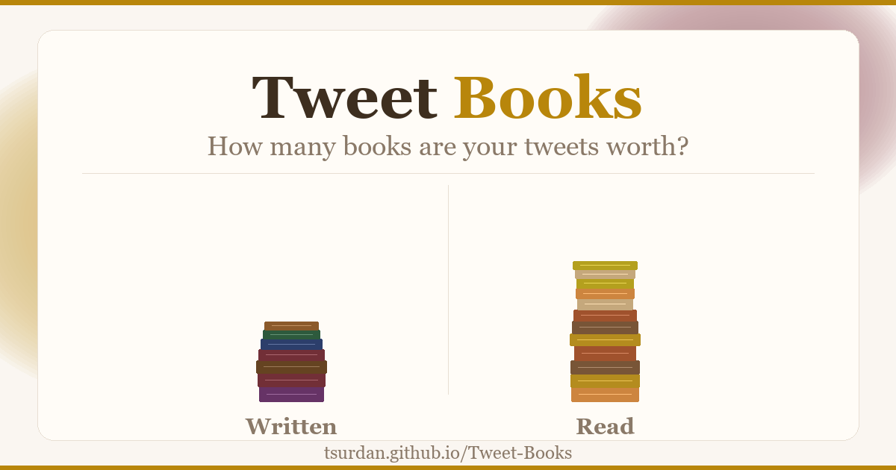

# 📚 Tweet Books

**How many books are your tweets worth?**

Turn your Twitter activity into books — see how much you've *written* and *read* just by tweeting and liking.



## 🔗 Live Site

**[tsurdan.github.io/Tweet-Books](https://tsurdan.github.io/Tweet-Books/)**

## What it does

Enter your Twitter/X username and the site fetches your tweet count and like count, then converts them into equivalent books:

- **Written** — based on your total tweets × average tweet word count
- **Read** — based on your total likes × average liked-tweet word count
- **Author rank** — see what kind of literary figure you are
- **Literary joke** — a custom quip based on your exact stats

## How it works

| Source | Conversion |
|--------|-----------|
| 1 tweet | ~18 words written |
| 1 like | ~20 words read |
| 1 book | ~60,000 words (~250 pages) |

Data is fetched via the community-maintained [FxTwitter](https://github.com/FixTweet/FxTwitter) API — no login or API key required.

## Tech

- Pure HTML + CSS + Vanilla JS — zero dependencies, zero build tools
- Static site hosted on GitHub Pages
- Messy 3D book pile visualization with proportional heights
- Word-by-word magic reveal animation for the literary joke
- Full Open Graph / Twitter Card meta tags for rich link previews

## Local development

Just open `index.html` in a browser. No server needed.

```bash
git clone https://github.com/tsurdan/Tweet-Books.git
cd Tweet-Books
open index.html   # or just double-click it
```

## Regenerating the preview image

```bash
pip install pillow
python gen_og.py
```

---

Built with [Claude](https://claude.ai) by [@_Tsur_](https://x.com/_Tsur_)
